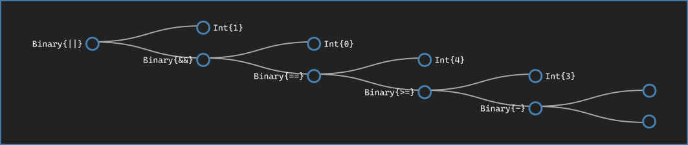
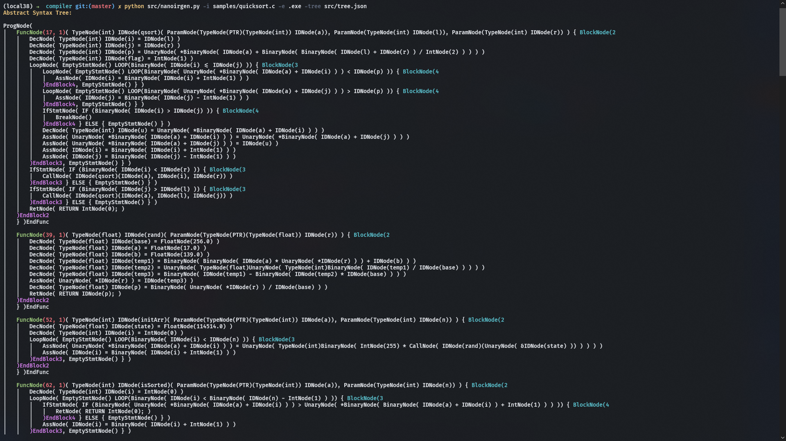
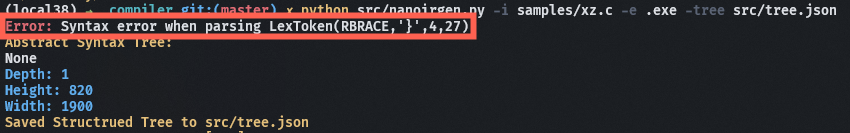
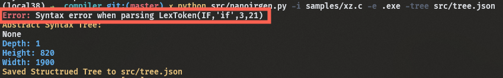

# Nano C Compiler

The C programming language compiler with extremely limited functionality.

We'd only implement a subset of a subset of C. Don't even expect preprocessing.

And **do remember to delete these lines after this repo goes public**

Visit [the tree visualizer](http://neon-cubes.xyz:8000/src/nanoast.html) to see what abstract tree the developer is lately developing.

<center><strong style="font-size: 1.8em">If You're Viewing the PDF Format of This File</strong></center>

==IMPORTANT: To better grasp the ability of our Abstract Syntax Tree visualizer, go to the [GitHub](https://github.com/dendenxu/compiler) of this repo to see for yourself.==

==IMPORTANT: The visualizer is hosted at: [my server](http://neon-cubes.xyz:8000/src/nanoast.html)==

[toc]

## Chapter 1 - Lexical Analysis

### §1.1 Token Specification

- Types: `int`, `long`, `double`, `float`, `char`, `void`, `[]`, **pointer**
- Control Flow: `if`, `else`, `while`, `for`, `continue`, `break`, `do-while`
- Function: `return`, **typed functions**, **scope**(`{}` `;`)
- Operators (with precedence):
  1. `()` `[]` Function Call, Array Subscription
  2. `-` `+` `++` `--` `!` `&` `*` `~` `(type)` Negation, Positive Number, Minus Minus, Plus Plus, Logical Not, Bitwise And, Get Element Of Pointer, Bitwise Not, Type Casting
  3. `*` `/` `%` Times, Divide, Modulus
  4. `+` `-` Plus, Minus
  5. `<<` `>>` Shift Left, Shift Right
  6. `<` `<=` `>` `<=` Less Than, Less Than Or Equal To, Greater Than, Greater Than Or Equal To
  7. `==` `!=` Equality, Inequality
  8. `&` Get Element Pointer
  9. `^` Bitwise XOR
  10. `|` Bitwise Or
  11. `&&` Logical And
  12. `||` Logical Or
  13. `?:` Conditional Expression
  14. `=` `<<=` `>>=` `&=` `|=` `^=` `+=` `-=` `/=` `*=` `%=` Assignment Operation
- Comment:
  1. `//` (one-line comment)
  2. `/* */` (multi-line comment)

### §1.2 Token Definition

Token List:

```python
keywords = (
    'INT', 'LONG', 'FLOAT', 'DOUBLE', 'CHAR',
    'UNSIGNED', 'CONST', 'VOID', "STATIC"
    'ENUM', 'STRUCT', 'UNION', 'IF', 'ELSE',
    'DO', 'WHILE', 'FOR', 'CONTINUE', 'BREAK', 'RETURN'
)
# All the tokens recognized by the lexer
tokens = keywords + (
    # Identifiers
    'ID',

    # constants
    'INT_CONST_DEC',
    'FLOAT_CONST',
    'CHAR_CONST',

    # String literals
    'STRING_LITERAL',

    # Operators
    'PLUS', 'MINUS', 'TIMES', 'DIVIDE', 'MOD',
    'OR', 'AND', 'NOT', 'XOR', 'LSHIFT', 'RSHIFT',
    'LOR', 'LAND', 'LNOT',
    'LT', 'LE', 'GT', 'GE', 'EQ', 'NE',

    # Assignment
    'EQUALS', 'TIMESEQUAL', 'DIVEQUAL', 'MODEQUAL',
    'PLUSEQUAL', 'MINUSEQUAL',
    'LSHIFTEQUAL', 'RSHIFTEQUAL', 'ANDEQUAL', 'XOREQUAL',
    'OREQUAL',

    # Increment/decrement
    'PLUSPLUS', 'MINUSMINUS',

    # Structure dereference (->)
    'ARROW',

    # Conditional operator (?)
    'CONDOP',

    # Delimeters
    'LPAREN', 'RPAREN',         # ( )
    'LBRACKET', 'RBRACKET',     # [ ]
    'LBRACE', 'RBRACE',         # { }
    'COMMA', 'PERIOD',          # . ,
    'SEMI', 'COLON',            # ; :
)
```

Important Regular Expression Definitions

```python
identifier = r'[a-zA-Z_$][0-9a-zA-Z_$]*'

decimal_constant = '(0+)|[1-9][0-9]*'

cconst_char = r"""[^'\\\n]"""
char_const = "'"+cconst_char+"'"
multicharacter_constant = "'"+cconst_char+"{2,4}'"
unmatched_quote = "('"+cconst_char+"*\\n)|('"+cconst_char+"*$)"

# string literals (K&R2: A.2.6)
string_char = r"""[^"\\\n]"""
string_literal = '"'+string_char+'*"'

# floating constants (K&R2: A.2.5.3)
exponent_part = r"""([eE][-+]?[0-9]+)"""
fractional_constant = r"""([0-9]*\.[0-9]+)|([0-9]+\.)"""
floating_constant = '(((('+fractional_constant+')'+exponent_part+'?)|([0-9]+'+exponent_part+'))[FfLl]?)'

# empty space
t_ignore = ' \t'

# Comment
t_ignore_SING_COMMENT = r'//.*?\n'
t_ignore_MULT_COMMENT = r'/\*(\*(?!\/)|[^*])*\*\/'
```

We used the `PLY` (Python Lex Yacc) to help better recognize regular expressions and BNF grammars to make our life easier.

We only need to import the "lexer" from the PLY module using `from ply import lex`

And build it with `lex.build`, passing specific module into the build function.

The lexer utilizes Python's object reflection (introspection) so it needs the current building context to extract regular expressions and map them to corresponding tokens.

It mainly recognize variables defined as `t_TOKEN_NAME`, the content of the variable corresponds to the regular expression, and the `TOKEN_NAME` part would be the token this RE recognizes for.

### §1.3 Specific Optimizations

#### Token Removal

By using `t_ignore` pattern or not returning the recognized token, we discard unwanted information provided by the program source code for readability of us **humans** (but not for the **parser**)

- White Space
- New Line Characters
- Comments
  - Single-lined comment
  - Multi-lined comment

```python
# empty space
t_ignore = ' \t'
```

#### Line Number Memory

To help the user pinpoint what's gone wrong the tokenization process, `PLY` "remembers" every token's location (in terms of line number and token column), which will even be used in the later syntax analysis process.

Specifically, we used `r'\n+'` to indicate newline(s)

- It's important to notice that **multi-line comment/single-line comment might also consume the newline character**
- Also note that `r'\n+'` regular expression might contain multiple newline characters

So we should use patterns like `t.lexer.lineno += t.value.count("\n")` to update the new line count accordingly.

```python
# Define a rule so we can track line numbers
def update_lineno(self, t):
    t.lexer.lineno += t.value.count("\n")

# Comment
def t_SINGLE_LINE_COMMENT(self, t):
    r'//.*?\n'
    self.update_lineno(t)

def t_MULTI_LINE_COMMENT(self, t):
    r'/\*(\*(?!\/)|[^*])*\*\/'
    self.update_lineno(t)

def t_NEWLINE(self, t):
    r'\n+'
    self.update_lineno(t)
```

#### Order of Regular Expression

We carefully optimized the **order** in which each regular expression is provided to the lexer, to make sure some overlapping definitions don't get mixed up, for example:

- `//` for line comment comes before `/` Operator
- `/*` for multi-line comment comes before `/` Operator
- `ID` for identifier comes after other constants that may include characters and numbers (**char literal, string literal, int/float constant values**)

## Chapter 2 - Syntax Analysis

### §2.1 Grammar Syntax for Nano C language

Firstly, let's take a comprehensive look at our grammar:

1. We _don't_ implement preprocessing like **macros** and **includes**

   - You **cannot** `#define` or `#include`

2. We _don't_ implement multi-file compilation, as a direct cause of the first rule

   - You **cannot** `python nanoirgen.py a.c b.c c.c -o a.out`

3. Thus we want a program to define the whole program (a single C source file)

4. This program should contain some **global variable definitions**

5. This program should also contain some **function definitions**

6. We _don't_ support **external linkage** variable definitions due to rule number one

7. We _don't_ support function/global variable **declaration**s since it won't be of much use in this setup.

8. Every valid statement should be

   1. A **block of statements**

      Wrapped within two paired curly brackets, namely `{`, `}`

      This block can **recursively contain other statements**

      You can happily and inconsequently do `{{{{{;}}}}}`

   2. Some **control flows**

      1. `for (int i = 0; i < 100 ; i++ ) {;}` for loops

      2. `while (1) {;}` while loops

      3. `do {;} while(1);` do-while loops

      4. `if(1) {;} else if(2) {;} else {;}` if-else statements

      5. Note that we forbid empty block `{}`

      6. But **one single (non-blocked) statement will be valid**, for example: `if(1) print(1); else print(2);`

         Actually, the nested `if` `else if` `else` block is implemented by viewing the second `if-else` block as a single statement

         `if (1) {;} else { if (2) {;} else {;} }`

         You can do crazy things as long as you remember you're writing out one single statement

         `while (1) while(0) while(controller) do p = "inside while loop"; while ( condition == "OK" );`

      7. Every control flow has its own block whether it's wrapped within the brackets, or just a **valid single statement** mentioned above

         Since **blocks** are used for scope resolution

   3. Or **ends with `;`**

      1. `return;` statement (you can return nothing)
      2. **declaration** statement to be talked about below
      3. `;` is also a valid statement

9. The variable definition takes traditional C form, with corresponding scope resolution

   1. `int a;` will define the variable `a` as uninitialized memory space

   2. `int a = 1;` will define the variable `a`, and initialize it to `1`

   3. `int a = 1, b = 2` will define both `a` and `b` and individually initialize them as specified by the user

      On a grammar level, this is expanded to be a bunch of variable definition and initialization to avoid a deep traversal into the actual AST

      _This optimization would be later illustrated in better detail in the next section_

   4. Note that type node should only be declared once in one declaration statement or declaration list, meaning `int * a, * b` is illegal, while `int *********** a, b, c=1, d` is OK

10. Every **block** of statements indicates a new name scope, whose resolution will be later talked about in the [Code Generation](#Chapter 5 - Code Generation) section

    _This optimization would be later illustrated in better detail in the next section_

11. An expression falls in the following group:

    1. **Binary Operations**: left hand side and right hand size operated by the operator

    2. **Unary Operations**: a single operator acted upon some other expression

       We use **assignment operation** to simplify the use of `++`, `--` unary operators

       These're simply reconstructed to `a = a + 1` (with assignment operation returning the assigned values)

       _This optimization would be later illustrated in better detail in the next section_

    3. **Ternary Operation**(s): currently only supporting `?:` as ternary operators

    4. **Assignment Expression**: the assignment of some `ID` or a dereferenced valid pointer `*(a+3)`, typically referred to as _left values_

       Specific operators and their corresponding operations/precedence are defined in [Lexical Analysis](#Chapter 1 - Lexical Analysis) sections

       Note that we define the grammar from a **low to high** precedence order to account for their ambiguous order and associativity if not carefully specified.

       - Note that **compound assignment** operations can be easily comprehended as a corresponding expression with a regular assignment operation: `<<=` `+=` `-=`, etc.

         _This optimization would be later illustrated in better detail in the next section_

    5. **Function Calls** in the form of `ID(expression list)`

       You can also specify **no parameter**

    6. **Array Subscription** in the form of `ID[expression]`

       In array definition (not an expression), you can also specify a set of empty bracket pairs, indicating a so-called "multidimensional array"

       **Although they're expected to be allocated as a continuous blob in the runtime memory**

12. Expressions can be grouped by `(` and `)` to indicate their correspondence

    As long as the grammar is unambiguous in this section, the programmer should be able to define arbitrarily complex expressions

13. Expressions should also able to be downgraded to some specific stuff:

    1. `ID` for identifiers, this can be variables or functions names
    2. **integer constant** for some literal integers
    3. **float constant** for some floating points
    4. **character constant** wrapped with `''`
    5. **string constant** wrapped with `""`

14. We restrict that only **Unary Operation** can be used at the left side of an assignment. Though this restriction is far from achieving a true **valid left value** check, it would surely make the process of type checking less painful

    _This optimization would be later illustrated in better detail in the next section_

### §2.2 BNF Definition for the Nano C Language

According to the above grammar specification, we define the following BNF grammars to recognize the specific token patterns

1. We used the careful ordering of grammar production to support complex precedence
2. We inherited the line number and column identification from **tokens** to give some comprehensive error message
3. BNF are written in a nest-able form, allowing for easy recognition of recursively nested grammar

```python
"""
Grammars written here is for you (the human reading this) to have a comprehensive understanding of the NanoC language. They're written in BNF for better copy-pasting compability for the parser, and it should be just the same as the ones used in the parser to build the AST.

Productions used in the parser:

        program             : program function
                            | program declaration
                            |
        function            : type id LPAREN param_list RPAREN curl_block
        param_list          : type id comma_paramters
                            | VOID
                            |
        comma_params        : comma_params COMMA type id
                            |
        block               : block curl_block
                            | block statement
                            |
        id                  : ID
        type                : INT
                            | VOID
                            | LONG
                            | FLOAT
                            | DOUBLE
                            | CHAR
                            | type TIMES
        statement           : expression SEMI
                            | declaration
                            | IF LPAREN expression RPAREN ctrl_block ELSE ctrl_block
                            | IF LPAREN expression RPAREN ctrl_block
                            | FOR LPAREN for_init RPAREN ctrl_block
                            | WHILE LPAREN expression RPAREN ctrl_block
                            | DO ctrl_block WHILE LPAREN expression RPAREN SEMI
                            | RETURN empty_or_exp SEMI
                            | BREAK SEMI
                            | CONTINUE SEMI
                            | SEMI
        for_init            : empty_or_exp SEMI empty_or_exp SEMI empty_or_exp
                            | declaration empty_or_exp SEMI empty_or_exp
        exp_list            : expression comma_exps
                            |
        comma_exps          : comma_exps COMMA expression
                            |
        empty_or_exp        : expression
                            |
        ctrl_block          : curl_block
                            | statement
        curl_block          : LBRACE block RBRACE
        declaration         : type dec_list SEMI
        dec_list            : dec_list COMMA id array_list typeinit
                            | id array_list typeinit
        typeinit            : EQUALS expression
                            |
        array_list          : array_list LBRACKET INT_CONST_DEC RBRACKET
                            |
        expression          : assignment
        assignment          : conditional
                            | unary EQUALS expression
        conditional         : logical_or
                            | logical_or CONDOP expression COLON conditional
        logical_or          : logical_and
                            | logical_or LOR logical_and
        logical_and         : bitwise_or
                            | logical_and LAND bitwise_or
        bitwise_or          : bitwise_xor
                            | bitwise_or OR bitwise_xor
        bitwise_xor         : bitwise_and
                            | bitwise_xor XOR bitwise_and
        bitwise_and         : equality
                            | bitwise_and AND equality
        equality            : relational
                            | equality (EQ|NE) relational
        relational          : shiftable
                            | relational (LT|GT|LE|GE) shiftable
        shiftable           : additive
                            | shiftable (LSHIFT|RSHIFT) additive
        additive            : multiplicative
                            | additive (PLUS|MINUS) multiplicative
        multiplicative      : unary
                            | multiplicative (TIMES|DEVIDE|MOD) unary
        unary               : postfix
                            | (PLUS|MINUS|NOT|LNOT|TIMES|AND|PLUSPLUS|MINUSMINUS) unary
                            | LPAREN type RPAREN unary
        postfix             : primary
                            | id LPAREN exp_list RPAREN
                            | postfix LBRACKET expression RBRACKET
                            | id PLUSPLUS
                            | id MINUSMINUS
        primary             : INT_CONST_DEC
                            | FLOAT_CONST
                            | CHAR_CONST
                            | STRING_LITERAL
                            | id
                            | LPAREN expression RPAREN
"""
```

As mentioned above, we used the `PLY` package for token/syntax recognition

With a well-defined grammar, the next step is to parse corresponding production into a well-organized **Abstract Syntax Tree**, which will be illustrated in more detail in the following section

Being an **abstract** syntax tree, a large portion of the parsing is simply to define which production results in which kind of tree node, and how those nodes are to be organized correctly

```python
#############################################################
#                  Arithmetic/Logical Operations            #
#############################################################

def p_binary_operators(self, p):
    '''
    logical_or          : logical_or LOR logical_and
    logical_and         : logical_and LAND bitwise_or
    bitwise_or          : bitwise_or OR bitwise_xor
    bitwise_xor         : bitwise_xor XOR bitwise_and
    bitwise_and         : bitwise_and AND equality
    equality            : equality EQ relational
                        | equality NE relational
    relational          : relational LT shiftable
                        | relational GT shiftable
                        | relational GE shiftable
                        | relational LE shiftable
    shiftable           : shiftable LSHIFT additive
                        | shiftable RSHIFT additive
    additive            : additive PLUS multiplicative
                        | additive MINUS multiplicative
    multiplicative      : multiplicative TIMES unary
                        | multiplicative DIVIDE unary
                        | multiplicative MOD unary
    '''
    p[0] = BinaryNode(p[2], p[1], p[3])

```

Take this binary operation parsing as an example:

- The precedence are defined within the grammar itself

- The actual operator takes similar form (a string of one/two special character indicating a specific operation)

- Nested parenthesis pairs and the actual positioning (where these operations should appear) of those operations are well defined into the **tree-structure** (_the parse tree_)

- Boiling down to the AST building, all we have to do is construct the AST node and store it for later (upper in the parse tree)

  ```python
  p[0] = BinaryNode(p[2], p[1], p[3])
  ```

Thanks to the parse tree, `p[1]`, `p[2]`, `p[3]` are already valid elements of the AST (constructed in the parsing process before this one and saved to the **parsed object `p[0]`**)

For example, some consecutive parsing of binary operations (`LPAREN` and `RPAREN` taken care of, omitted here) might be flattened like this:

```python
p[0] = BinaryNode(BinaryNode(BinaryNode(p[2], p[1], BinaryNode(p[2], p[1], p[3])), p[1], p[3]), p[1], BinaryNode(BinaryNode(p[2], p[1], p[3]), p[1], BinaryNode(p[2], p[1], p[3])))
```

A nice visualization of this might be like:



### §2.3 Actual Implementation

```python
#############################################################
#                      Syntax Error Rules                   #
#############################################################

def p_error(self, p):
    # with a syntax error, the token should contain corresponding location
    print(colored("Error: ", "red")+"Syntax error when parsing "+str(p))

#############################################################
#                      External Functions                   #
#############################################################

def parse(self, input, **kwargs) -> Node:
    try:
        return self.parser.parse(input, **kwargs)
    except Exception as e:
        traceback.print_exc()
        print(colored("Error: ", "red")+f"{e}")

def build(self, **kwargs):
    self.parser = yacc.yacc(module=self, **kwargs)

tokens = NanoLexer.tokens
```

Similar to the lexer, `yacc` needs to be specifically built for using.

We pass in `module=self` to make YACC track production definition in current object scope using object reflection.

```python
tokens = NanoLexer.tokens
```

is needed to define valid tokens to recognize for (usually marked UPPER CASE CHARACTER).

To make the parsing process more visible and viable, we defined the main function of the `nanoyacc.py` program as this:

```python
if __name__ == '__main__':
    import argparse
    parser = argparse.ArgumentParser()
    parser.add_argument("-input", default="samples/fx.c", type=str)
    parser.add_argument("-tree", type=str)
    parser.add_argument("-url", default="http://neon-cubes.xyz:8000/src/tree.json", type=str)
    args = parser.parse_args()

    with open(args.input, 'r', encoding='utf-8') as f:
        content = f.read()
        lexer = NanoLexer()
        lexer.build()
        parser = NanoParser()
        parser.build()
        root = parser.parse(content, debug=0)
        print(colored(f"Abstract Syntax Tree:", "yellow", attrs=["bold"]))
        print(root)

        tree = traverse(root)
        print(colored("Structrued Tree: ", 'yellow', attrs=['bold']))
        print(tree)
        addinfo(tree, args.input)
        payload = json.dumps(tree)

        if args.tree:
            with open(args.tree, 'w') as f:
                f.write(payload)
            print(colored(f"Saved Structrued Tree to {args.tree}", 'yellow', attrs=['bold']))

        r = requests.post(url=args.url, data=payload)
        print(colored(f"POST response: {r}", "yellow", attrs=["bold"]))
```

1. `argparse` exists so we have a friendly command-line interface for the **nanoparser**
2. `lexer` is built and automatically stored in a safe position (a global variable `ply.lex.lexer`)
3. `parser` is also built and automatically stored in a safe position `ply.yacc.parser`
4. `root` is returned by the parser as the root of the AST, to be used by the intermediate representation generator
5. `tree` is the simplified version (ready to be displayed with good visual look)
6. We set up a server to receive the AST JSON object for mobility and compatibility for the visualization of the AST nodes
7. `colored` from `termcolor` is applied extensively to give a visually pleasant command-line output
8. `tree.json` will also be saved as a file for inspection

### §2.4 Specific Optimizations

#### Flattening

We flatten declaration operations to make the actual IR generation a little bit less painful.

- Given a list of declarations, initialized or not, we flatten all declarations into individual statements, so the compiler backend can uniformly take care of them

  `int a, b, c;` would initially produce a list of declaration as `[DecNode, DecNode, DecNode]`

  When the outer block is encountered, those expressions are flattened out as

  `DecNode; DecNode; DecNode;`

- This is implemented with the help of `BlockNode`

  ```python
  def p_block_stmt(self, p):
      '''
      block               : block curl_block
                          | block statement
      '''
      if p[1] is None:
          p[1] = BlockNode()
      if isinstance(p[2], list):
          for dec in p[2]:
              p[1].append(dec)
      else:
          p[1].append(p[2])
      p[0] = p[1]
  ```

The above implementation also illustrates other implementation of flattening listed grammar

```python
'''
    block               : block curl_block
                        | block statement
                        |
'''
```

is **left recursive**, thus the first block might just be `None`, and later all other blocks should be appended accordingly to whether we've already constructed a list from the first element.

Similar optimization occurs when we're parsing **expression list** of function call/**parameter list** of function definition

- **Expression List** in function call:

  ```python
  def p_exp_list(self, p):
      '''
      exp_list            : expression comma_exps
      '''
      if p[2] is None:
          p[2] = []
      p[2] = [p[1]] + p[2]
      p[0] = p[2]

  def p_comma_exp_list(self, p):
      '''
      comma_exps          : comma_exps COMMA expression
      '''
      if p[1] is None:
          p[1] = []
      p[1].append(p[3])
      p[0] = p[1]
  ```

- **Parameter List** in function definition

  ```python
  #############################################################
  #                     Function Definition                   #
  #############################################################

  def p_func_def(self, p):
      '''
      function            : type id LPAREN param_list RPAREN curl_block
      '''
      p[0] = FuncNode(p[1], p[2], p[4], p[6])

  def p_params(self, p):
      '''
      param_list          : type id comma_params
      '''
      param = ParamNode(p[1], p[2])
      if p[3] is None:
          p[3] = []
      p[3] = [param] + p[3]
      p[0] = p[3]

  def p_comma_params(self, p):
      '''
      comma_params        : comma_params COMMA type id
      '''
      param = ParamNode(p[3], p[4])
      if p[1] is None:
          p[1] = []
      p[1].append(param)
      p[0] = p[1]
  ```

#### Preparations for Scope Resolution

Every **block** of statements indicates a new name scope, whose resolution will be later talked about in the [Code Generation](#Chapter 5 - Code Generation) section

Note that `BlockNode` is **_ABSTRACT_**, meaning with the total removal of it, the compiler should still be able to work properly. The purpose of the aggregated node is to indicate nested scope creation

- Thus, when parsing curly brackets pairs, we explicitly generate a `BlockNode` to mark the creation of a new scope

- We also took care of `if-else-stmt` and `for-do-while-loop` statements, whose statement body is valid even when they've only got one individual statement

  Those individual statement are also wrapped with an abstract `BlockNode`

#### Abstraction of Complex Syntax

For the compiler backend, `a += 1` is the same as `a = a + 1` and in our implementation, `a++` or `++a`

So, when implementing similar relatively complex grammar, the parser automatically translates it to the format that the compiler recognizes

Thus a simple `AssNode` (meaning, `Assignment Node`) can take care of all of these and free the IR from recognizing complex assignment and syntax sugar

This is implemented as:

```python
def p_assignment(self, p):
    '''
    assignment          : unary EQUALS expression
                        | unary TIMESEQUAL expression
                        | unary DIVEQUAL expression
                        | unary MODEQUAL expression
                        | unary PLUSEQUAL expression
                        | unary MINUSEQUAL expression
                        | unary LSHIFTEQUAL expression
                        | unary RSHIFTEQUAL expression
                        | unary ANDEQUAL expression
                        | unary XOREQUAL expression
                        | unary OREQUAL expression
    unary               : PLUSPLUS unary
                        | MINUSMINUS unary
    postfix             : postfix PLUSPLUS
                        | postfix MINUSMINUS

    '''
    if len(p) == 4:
        if len(p[2]) == 1:  # true assignment
            p[0] = AssNode(p[1], p[3])
        else:
            if len(p[2]) == 3:
                op = p[2][:2]
            else:
                op = p[2][:1]
            p[0] = AssNode(p[1], BinaryNode(op, p[1], p[3]))

    else:
        if p[1] == "++":
            p[0] = AssNode(p[2], BinaryNode('+', p[2], IntNode(1)))
        elif p[1] == "--":
            p[0] = AssNode(p[2], BinaryNode('-', p[2], IntNode(1)))
        elif p[2] == "++":
            p[0] = AssNode(p[1], BinaryNode('+', p[1], IntNode(1)))
        elif p[2] == "--":
            p[0] = AssNode(p[1], BinaryNode('-', p[1], IntNode(1)))
        p[0].exp.update_pos(p.lineno(1), self._find_tok_column(p.lexpos(1)))
    p[0].update_pos(p.lineno(1), self._find_tok_column(p.lexpos(1)))
```

#### Trick for Solving the Dangling Else Problem

The dangling else problem in grammar syntax parsing appears when no restriction is applied on the end of if statement

with a grammar definition like:

```python
 '''
    statment                   : IF LPAREN expression RPAREN ctrl_block ELSE ctrl_block
                               | IF LPAREN expression RPAREN ctrl_block
 '''
```

and a program like this:

```python
if (1) if (2) ; else ;
```

The else can be associated with the first `if` like with brackets:

```python
if (1) { if (2) ; } else ;
```

Or the second `if`:

```python
if (1) { if (2) ; else ; }
```

**without violating the grammar definition**!

This is commonly known as _the dangling else_ problem:

- Whether and else statement should be paired with the outer most if statement or the inner most unpaired one?

There's an ugly solution to this:

- Define the grammar so that **only unmatched statement** can be associated with the if statement

  ```python
  '''
  statement                : matched-stmt | unmatched-stmt
  matched-stmt             : if  ( exp ) matched-stmt else matched-stmt
                           | other
  unmatched-stmt           : if  ( exp ) statement
                           | if  ( exp ) matched-stmt else unmatched-stmt
  exp                      : 0 | 1
  '''
  ```

  > **This works by permitting** only a matched-statement to come before an else in an if-statement**, thus forcing all else-parts to be matched as soon as possible.**

  But this solution would require some painful modification of the parser code

- And another solution would be marking the end of the if-else block with some special token like `end-if`

  ```python
  if (1) ; else ; endif
  ```

  Effectively acting as a pair (pairs) of curly brackets

  solving the ambiguity by make the programmer do more

- The **most popular** solution is to actually leave the grammar be

  Leave everything be and let the **LALR** parser **prefer shift over reduce** when there's a shift-reduce conflict

  And this is also the solution that we used

  ```plaintext
  ...
  ...
  state 196

      (17) statement -> IF LPAREN expression RPAREN ctrl_block .
      (18) statement -> IF LPAREN expression RPAREN ctrl_block . ELSE ctrl_block

    ! shift/reduce conflict for ELSE resolved as shift
      ELSE            shift and go to state 202

    ! ELSE            [ reduce using rule 17 (statement -> IF LPAREN expression RPAREN ctrl_block .) ]
  ...
  ...
  WARNING:
  WARNING: Conflicts:
  WARNING:
  WARNING: shift/reduce conflict for ELSE in state 196 resolved as shift
  ```

  > If the parser is produced by an SLR, LR(1) or LALR [LR parser](https://en.wikipedia.org/wiki/LR_parser) generator, the programmer will often rely on the generated parser feature of preferring shift over reduce whenever there is a conflict.[[2\]](https://en.wikipedia.org/wiki/Dangling_else#cite_note-Bison_Manual-2) Alternatively, the grammar can be rewritten to remove the conflict, at the expense of an increase in grammar size

## Chapter 3 - Abstract Syntax Tree

### §3.1 Node Design

We adopted the OOP design pattern to make life easier for `pylance`, the type checking utility and auto-complete functionality of the developer's IDE

`Node` is defined to be the base class of every node and this type can be used to distinguish an actual `NanoAST` node from some string/number literals and original python literals like `list`s or `dict`s.

Specifically, We have

- A base class `Node` for all AST nodes

- A base class `EmptyStmtNode` sub-classing `Node`, acting as base class of all primitive statements, including

  - `IfStmtNode`
  - `LoopNode` for all looping including
    - `FOR` loop
    - `WHILE` loop
    - `DO-WHILE` loop
  - `DecNode`
  - `RetNode`
  - `BlockNode` for aggregating all other statements
  - `BreakNode`
  - `ContinueNode`

  Note that an `Expression` followed by a `SEMI` (semicolon) is also a valid statement, but for **abstraction**, we extract that to be able to be directly embedded in `BlockNode`

- A base class `EmptyExpNode` sub-classing `Node`, acting as base class of all primitive expressions, including

  - `CallNode` for function call
  - `UnaryNode` for unary operations
  - `BinaryNode` for binary operations
  - `TernaryNode` for ternary operations
  - `AssNode` for assignment expressions
  - `ArrSubNode` for subscription of an array/pointer

### §3.2 Tree Traversal

### §3.3 Tree Visualization and Interaction

==IMPORTANT: To better grasp the ability of our Abstract Syntax Tree visualizer, go to the [GitHub](https://github.com/dendenxu/compiler) of this repo to see for yourself.==

==IMPORTANT: The visualizer is hosted at: [my server](http://neon-cubes.xyz:8000/src/nanoast.html)==

On the hosted server mentioned above, we have a nice little html (including some `javascript`) to display the abstract syntax tree in an understandable and **interactive** manner.

If you're able to see the moving GIF, I don't think I need to explain more.

If you're seeing a static image, please read the `IMPORTANT` message a few lines above.


The server is also designed to accept incoming compilation, so you can basically update what to display to everyone by uploading the `tree.json` traversed to the server.

Implementation:

```python
tree = traverse(root)
addinfo(tree, args.input)
# Print Struct Tree (data sent to server)
print(colored("Structrued Tree: ", 'yellow', attrs=['bold']))
print(tree)
payload = json.dumps(tree)

if args.tree:
    with open(args.tree, 'w') as f:
        f.write(payload)
        print(colored(f"Saved Structrued Tree to {args.tree}", 'yellow', attrs=['bold']))

r = requests.post(url=args.url, data=payload)
print(colored(f"POST response: {r}", "yellow", attrs=["bold"]))
```


You're also able to download a fully viewable tree from the server directly (or rather, from the `nanoast.html` you're visiting)


You'll see similar **SVG** embedded in our report later in the Code Generation section.

### §3.4 Optimization Considerations

#### Better Debugging Interface

When designing the base class of all nodes, we considered the need to pretty print all things from command-line, thus a `indentLevel` is added and all `__str__` methods of nodes are designed to recursively do a depth first search on the abstract syntax tree to produce some human readable parsing results (with formats!)

```python
class Node(object):
    # A simple Abstract Syntax Tree node
    TABSTR = '|   '

    def __init__(self):
        self._indentLevel = 0
        self._lineno = self._colno = 0

    def update_pos(self, line: int, col: int):
        self._lineno = line
        self._colno = col

    def accept(self, visitor: NanoVisitor):
        pass
```



Also, with error message in mind, we printed detailed line numbering and column to help the compiler user location where things might have gone wrong as early as possible.

```c
int main()
{
    { ret
    }
}
```



```c
int main()
{
    if (if)
}
```



#### Better Coding

We adopted the OOP design pattern to make life easier for `pylance`, the type checking utility and auto-complete functionality of the developer's IDE

Before, you might need to check whether a node is valid by comparing some raw string:

```python
if node.name == "StmtNode": pass
```

This design makes the compiler writer get trapped in the pitfall of **typos**.

Now you only need to do

```python
if isinstance(node, StmtNode): pass
```

or

```python
if type(node) == StmtNode: pass
```

Writing things out explicitly makes the checker's life, and your life much easier by providing richer error messages.

I believe you've all had that afternoon spent digging into your code trying to find which tiny typo crashed your delicate, complex, strong program.

`Node` is defined to be the base class of every node and this type can be used to distinguish an actual `NanoAST` node from some string/number literals and original python literals like `list`s or `dict`s.

## Chapter 4 - Semantic Analysis

### §4.1 Name Resolution

### §4.2 Type Checking (L value Checking)

Type checking happens at many places and operations.

```python
binCompatDict = {
    #left       right      op       ret_type
    ('i32',     'i32',     '+' ):   'i32',
    ('i32',     'i32',     '-' ):   'i32',
    ('i32',     'i32',     '*' ):   'i32',
    ('i32',     'i32',     '/' ):   'i32',
    ('i32',     'i32',     '%' ):   'i32',
    ('i32',     'i32',     '<<'):   'i32',
    ('i32',     'i32',     '>>'):   'i32',
    ('i32',     'i32',     '!='):   'i1',
    ('i32',     'i32',     '=='):   'i1',
    ('i32',     'i32',     '<' ):   'i1',
    ('i32',     'i32',     '>' ):   'i1',
    ('i32',     'i32',     '<='):   'i1',
    ('i32',     'i32',     '>='):   'i1',
    ('i32',     'i32',     '||'):   'i1',
    ('i32',     'i32',     '&&'):   'i1',
    ('float',   'float',   '+' ):   'float',
    ('float',   'float',   '-' ):   'float',
    ('float',   'float',   '*' ):   'float',
    ('float',   'float',   '/' ):   'float',
    ('float',   'float',   '%' ):   'float',
    ('float',   'float',   '!='):   'i1',
    ('float',   'float',   '=='):   'i1',
    ('float',   'float',   '<' ):   'i1',
    ('float',   'float',   '>' ):   'i1',
    ('float',   'float',   '<='):   'i1',
    ('float',   'float',   '>='):   'i1',
    ('float',   'float',   '||'):   'i1',
    ('float',   'float',   '&&'):   'i1',
    ('i1',      'i1',      '+' ):   'i32',
    ('i1',      'i1',      '-' ):   'i32',
    ('i1',      'i1',      '*' ):   'i32',
    ('i1',      'i1',      '/' ):   'i32',
    ('i1',      'i1',      '%' ):   'i32',
    ('i1',      'i1',      '!='):   'i1',
    ('i1',      'i1',      '=='):   'i1',
    ('i1',      'i1',      '<' ):   'i1',
    ('i1',      'i1',      '>' ):   'i1',
    ('i1',      'i1',      '<='):   'i1',
    ('i1',      'i1',      '>='):   'i1',
    ('i1',      'i1',      '||'):   'i1',
    ('i1',      'i1',      '&&'):   'i1',
    ('i32',     'i1',      '+' ):   'i32',
    ('i32',     'i1',      '-' ):   'i32',
    ('i32',     'i1',      '*' ):   'i32',
    ('i32',     'i1',      '/' ):   'i32',
    ('i32',     'i1',      '%' ):   'i32',
    ('i32',     'i1',      '!='):   'i1',
    ('i32',     'i1',      '=='):   'i1',
    ('i32',     'i1',      '<' ):   'i1',
    ('i32',     'i1',      '>' ):   'i1',
    ('i32',     'i1',      '<='):   'i1',
    ('i32',     'i1',      '>='):   'i1',
    ('i32',     'i1',      '||'):   'i1',
    ('i32',     'i1',      '&&'):   'i1',
    ('i1',      'i32',     '+' ):   'i32',
    ('i1',      'i32',     '-' ):   'i32',
    ('i1',      'i32',     '*' ):   'i32',
    ('i1',      'i32',     '/' ):   'i32',
    ('i1',      'i32',     '%' ):   'i32',
    ('i1',      'i32',     '!='):   'i1',
    ('i1',      'i32',     '=='):   'i1',
    ('i1',      'i32',     '<' ):   'i1',
    ('i1',      'i32',     '>' ):   'i1',
    ('i1',      'i32',     '<='):   'i1',
    ('i1',      'i32',     '>='):   'i1',
    ('i1',      'i32',     '||'):   'i1',
    ('i1',      'i32',     '&&'):   'i1',
    ('float',   'i32',     '+' ):   'float',
    ('float',   'i32',     '-' ):   'float',
    ('float',   'i32',     '*' ):   'float',
    ('float',   'i32',     '/' ):   'float',
    ('float',   'i32',     '%' ):   'float',
    ('float',   'i32',     '!='):   'i1',
    ('float',   'i32',     '=='):   'i1',
    ('float',   'i32',     '<' ):   'i1',
    ('float',   'i32',     '>' ):   'i1',
    ('float',   'i32',     '<='):   'i1',
    ('float',   'i32',     '>='):   'i1',
    ('float',   'i32',     '||'):   'i1',
    ('float',   'i32',     '&&'):   'i1',
    ('i32',     'float',   '+' ):   'float',
    ('i32',     'float',   '-' ):   'float',
    ('i32',     'float',   '*' ):   'float',
    ('i32',     'float',   '/' ):   'float',
    ('i32',     'float',   '%' ):   'float',
    ('i32',     'float',   '!='):   'i1',
    ('i32',     'float',   '=='):   'i1',
    ('i32',     'float',   '<' ):   'i1',
    ('i32',     'float',   '>' ):   'i1',
    ('i32',     'float',   '<='):   'i1',
    ('i32',     'float',   '>='):   'i1',
    ('i32',     'float',   '||'):   'i1',
    ('i32',     'float',   '&&'):   'i1',
    ('i1',      'float',   '+' ):   'float',
    ('i1',      'float',   '-' ):   'float',
    ('i1',      'float',   '*' ):   'float',
    ('i1',      'float',   '/' ):   'float',
    ('i1',      'float',   '%' ):   'float',
    ('i1',      'float',   '!='):   'i1',
    ('i1',      'float',   '=='):   'i1',
    ('i1',      'float',   '<' ):   'i1',
    ('i1',      'float',   '>' ):   'i1',
    ('i1',      'float',   '<='):   'i1',
    ('i1',      'float',   '>='):   'i1',
    ('i1',      'float',   '||'):   'i1',
    ('i1',      'float',   '&&'):   'i1',
    ('float',   'i1',      '+' ):   'float',
    ('float',   'i1',      '-' ):   'float',
    ('float',   'i1',      '*' ):   'float',
    ('float',   'i1',      '/' ):   'float',
    ('float',   'i1',      '%' ):   'float',
    ('float',   'i1',      '!='):   'i1',
    ('float',   'i1',      '=='):   'i1',
    ('float',   'i1',      '<' ):   'i1',
    ('float',   'i1',      '>' ):   'i1',
    ('float',   'i1',      '<='):   'i1',
    ('float',   'i1',      '>='):   'i1',
    ('float',   'i1',      '||'):   'i1',
    ('float',   'i1',      '&&'):   'i1',
    ('i32*',    'i32',     '+' ):   'i32*',
    ('i32',     'i32*',    '+' ):   'i32*',
    ('float*',  'i32',     '+' ):   'float*',
    ('i32',     'float*',  '+' ):   'float*',
}
```


```python
allowed_casting = [
    ('i1'    , 'i32'  ),
    ('i32'   , 'float'),
    ('i1'    , 'float'),
    ('float' , 'i1'   ),
    ('float' , 'i32'  ),
    ('[@ x i32]*'  , 'i32*'  ),
    ('[@ x float]*', 'float*'),
    ('[@ x [@ x i32]]*'  , 'i32*'  ),
    ('[@ x [@ x float]]*', 'float*'),
    ('[@ x [@ x [@ x i32]]]*'  , 'i32*'  ),
    ('[@ x [@ x [@ x float]]]*', 'float*'),
]
```


## Chapter 5 - Code Generation

In the previous part, we have already obtained an abstract syntax tree. Then, we need to visit this tree to generate the target code. Of course we can directly generate target code like assembly language from this AST. However, on the consideration of scalability, we will first generate intermediate representation(IR) of this abstract syntax tree and then synthesize target code from this intermediate representation.

As for the generation of intermediate representation, we use a python package named `llvmlite`. `LLVMlite` is a small subset of the LLVM IR that we will be using throughout the course as the intermediate representation in our compiler. Conceptually, it is either an abstract assembly-like language or a even lower-level C-like language that is convenient to manipulate programmatically.

### §5.1 LLVM Intermediate Representation

To give you a sense of structure of `LLVMlite` programs and the most basic features, the following is our running example, the simple recursive factorial function written in the concrete syntax of the `LLVMlite` IR.

```assembly
    define i64 @fac(i64 %n) {              ; (1)
      %1 = icmp sle i64 %n, 0              ; (2)
      br i1 %1, label %ret, label %rec     ; (3)
    ret:                                   ; (4)
      ret i64 1
    rec:                                   ; (5)
      %2 = sub i64 %n, 1                   ; (6)
      %3 = call i64 @fac(i64 %2)           ; (7)
      %4 = mul i64 %n, %3
      ret i64 %4                           ; (8)
    }

    define i64 @main() {                   ; (9)
      %1 = call i64 @fac(i64 6)
      ret i64 %1
    }
```

First, notice the function definition at (1). The i64 annotations declare the return type and the type of the argument n. The argument is prefixed with "%" to indicate that it's an identifier local to the function, while `fac` is prefixed with "@" to indicate that it is in scope in the entire compilation unit.

Next, at (2) we have the first instruction of the body of `fac`, which performs a signed comparison of the argument %n and 0 and assigns the result to the temporary %1. The instruction at (3) is a "terminator", and marks the end of the current block. It will transfer control to either ret at (4) or rec at (5). The labels at (4) and (5) each indicate the beginning of a new block of instructions. Notice that the entry block starting at (2) is not labeled: in LLVM it is illegal to jump back to the entry block of a function body. Moving on, (6) performs a subtraction and names the result %2. The i64 annotation indicates that both operands are 64-bit integers. The function `fac` is called at (7), and the result named %3. Again, the i64 annotations indicate that the single argument and the returned value are 64-bit integers.

Finally, (8) returns from the function with the result named by %4, and (9) defines the main function of the program, which simply calls fac with a literal i64 argument.

### §5.2 Introduction of Visitor


To generate the IR mentioned above, we use a visitor class named `NanoVisitor`. Given an abstract syntax tree like the above figure, the visitor will first visit the `ProgNode` which is marked as root. Then the visitor will well grounded travel the children of root.

<<<<<<< HEAD

### §5.3 Design Pattern: Reflection

=======

#### Design Pattern: Reflection

> > > > > > > 6e2d9cfb0ae6167e07e85259869ad37810043584

One problem in traveling step is that visitor does not know the type of node and thus can not do specific actions depending on the type of node. To solve this problem, we use the design pattern of reflection. That is, the visitor will call the `accept` method of class node. The derived classes of `Node` will override the `accept` method to their own visiting procedure. So, the calling flow is just like `Visitor->Node->Visitor` which can be interpreted as reflection. A piece of sample code is shown as below:

```python
class NanoVisitor(Visitor):
    # ...
    def visitProgNode(self, node: ProgNode):
        # ...
        for func in node.funcs:
            func.accept(self)
        # ...
```

```python
class ProgNode(Node):
    # ...
    def accept(self, visitor: NanoVisitor):
        return visitor.visitProgNode(self)
class FuncNode(Node):
    # ...
    def accept(self, visitor: NanoVisitor):
        return visitor.visitFuncNode(self)
# ...
```

### §5.4 Attributes

During the IR generation, or in the other words, travelly visiting the AST, we need to set some attributes which may be referenced afterwards. Several key attributes in the visitor are shown as below:

- cur_module: a `llvmlite.ir.Module` object. This obj provides the IR generation environment, we can do nothing without it.

- cur_func_name: a `str` object. Mark which function is currently processed, initialized with empty string.

- builder_stack: a `llvmlite.ir.IRBuilder` object. This obj is used to insert IR instructions after the blocks.

- scope_stack: a `list` object. Each element in the stack is of type `dict`. This obj denotes the symbol table and scopes. The procedure of getting an identifier in the current scope just work like below:

  ```python
      def _get_identifier(self, name):
          for d in self.scope_stack[::-1]:  # reversing the scope_block
              if name in d:
                  return d[name]['ref']
          return None
  ```

- loop_exit_stack & loop_entr_stack: a `list` object. Since we support nested loop statements, continue and break statements, we need to remember the last entrance/exit point(usually interpreted as the beginning of a block). The next time we analysis break or continue, we can pop the exit stack or entrance stack and branch there.

- in_global: a `bool` object. Mark whether the visitor is currently at the global scope. If it is, the declared variable will be allocated in the global space.

```python
class NanoVisitor(Visitor):
    def __init__(self):
        # we do not need list since we only support single filre compiling
        self.cur_module = None
        # we do not need list since we do not support sub-procedure
        self.cur_func_name = ''
        self.builder_stack = []
        self.block_stack = []
        self.scope_stack = []
        self.loop_exit_stack = []
        self.loop_entr_stack = []
        self.in_global = True
        # ...
```

### §5.3 Implementation of Visitor

We select several visiting examples to illustrate how visiting procedure generates IR.

#### VisitBlockNode

The special point of the BlockNode is that, we need to create a new scope every time we enter the block.

```python
    def visitBlockNode(self, node: BlockNode, scope=None):
        self._push_scope(scope)
        for stmt in node.stmts:
            stmt.accept(self)
        return self._pop_scope()
```

for every statements in this block, it will call accept method and generates their own part IR.

#### VisitIfStmtNode

For the IfStmtNode, we will first evaluate the condition:

```python
    def visitIfStmtNode(self, node: IfStmtNode):
		node.cond.accept(self)
        pred = self._get_builder().icmp_signed('!=',
                                               val(node.cond),
                                               ir.Constant(int32, 0))
        if type(node.ifbody) == EmptyStmtNode:
            return
    	#...
```

And then generate IR in `then` and `otherwise` part:

```python
    	if type(node.elsebody) == EmptyStmtNode:
            with self._get_builder().if_then(pred) as then:
                self._push_scope()
                node.ifbody.accept(self)
                self._pop_scope()
        else:
            with self._get_builder().if_else(pred) as (then, othrewise):
                with then:
                    # ifbody
                    self._push_scope()
                    node.ifbody.accept(self)
                    self._pop_scope()
                with othrewise:
                    # elsebody
                    self._push_scope()
                    node.elsebody.accept(self)
                    self._pop_scope()
```

Notice that we use the APIs of llvmlite which are `IRBuilder.if_then` and `IRBuilder.if_else`. The former will yield a basic block, and we can generate `then` part IR in this block. The latter will yield two context managers, we can use keyword `with` to set at the begining of that block and generate `then/otherwise` part IR in them. The generating IR work is recursively done in the accept calling.

#### VisitLoopNode

We support three loop statements: `for`, `while` and `do-while`. Their procedure of generating IR are somewhat different. This is because the difference of their loop structures which are illustrated as below:

```txt
for:
	pre: EmptyStmtNode / DecNode
	cond: EmptyExpNode / subclass of EmptyExpNode / subclass of EmptyLiteralNode / IDNode
	body: BlockNode
	post: EmptyExpNode / subclass of EmptyExpNode / subclass of EmptyLiteralNode / IDNode
while:
	pre: EmptyStmtNode
	cond: EmptyExpNode / subclass of EmptyExpNode / subclass of EmptyLiteralNode / IDNode
	body: BlockNode
	post: EmptyStmtNode
do-while:
	pre: EmptyStmtNode()
	cond: EmptyExpNode / subclass of EmptyExpNode / subclass of EmptyLiteralNode / IDNode
	body: BlockNode()
	post: EmptyStmtNode()
```

Based on above analysis, we divide the loop statements into two cases:

- `for` and `while`:

  ```python
              """ do-while
                  ...
                  branch body_block
              body_block:
                  body...
                  branch cond_block
              cond_block [continue target]:
                  cond...
                  branch(cond, body_block, tail_block)
              tail_block [break target]:
                  ...
              """
  ```

- `do-while`:

  ```python
              """ for & while
                  ...
                  pre...
                  branch cond_block
              cond_block:
                  cond...
                  branch(cond, body_block, tail_block)
              body_block:
                  body...
                  branch post_block
              post_block [continue target]:
                  post...
                  branch cond_block
              tail_block [break target]:
                  ...
              """
  ```

In addition, to support the declaration in the for statements like `for(int i=0;i<n;i++)`, we adopt the scope creating/deleting procedure like this:

```txt
                ...scope_original...
        /======================scope_new_0===/
        /  pre -> cond <----|                /
        /  /=========|======|==scope_new_1===/
        /  /        body    |                /
        /  /=========|======|================/
        /           post----|                /
        /====================================/
```

We show the for/while IR generation below, for more details pleased refer to our source code.

```python
            cond_block = self._get_builder().append_basic_block()
            body_block = self._get_builder().append_basic_block()
            post_block = self._get_builder().append_basic_block()
            tail_block = self._get_builder().append_basic_block()
            self.loop_entr_stack.append(post_block)
            self.loop_exit_stack.append(tail_block)

            # scope_new_0
            self._push_scope()
            if type(node.pre) != EmptyStmtNode:
                node.pre.accept(self)
            self._get_builder().branch(cond_block)

            # entrance
            self._get_builder().position_at_start(cond_block)
            if type(node.cond) != EmptyExpNode:
                node.cond.accept(self)
                cond = self._get_builder().icmp_signed('!=',
                                                       val(node.cond),
                                                       ir.Constant(int32, 0))
            else:
                cond = int1(1)
            self._get_builder().cbranch(cond, body_block, tail_block)

            # scope_new_1 auto created when visitBlockNode
            self._get_builder().position_at_start(body_block)
            node.body.accept(self)
            self._get_builder().branch(post_block)

            # return to scope 0
            self._get_builder().position_at_start(post_block)
            if type(node.post) != EmptyStmtNode:
                node.post.accept(self)
            self._get_builder().branch(cond_block)
            self._pop_scope()

            # after
            self._get_builder().position_at_start(tail_block)

            self.loop_entr_stack.pop()
            self.loop_exit_stack.pop()
```

#### VisitBinopNode

The generation of binary operation IR is very simple, it only calls some APIs of llvmlite. The used APIs are: `llvm.ir.IRBuilder.add`, `llvm.ir.IRBuilder.sub`, `llvm.ir.IRBuilder.mul`, `llvm.ir.IRBuilder.sdiv`, `llvm.ir.IRBuilder.srem`, `llvm.ir.IRBuilder.shl`, `llvm.ir.IRBuilder.ashr`, `llvm.ir.IRBuilder.icmp_signed`, `llvm.ir.IRBuilder.fadd`, `llvm.ir.IRBuilder.fsub`, `llvm.ir.IRBuilder.fmul`, `llvm.ir.IRBuilder.fdiv`, `llvm.ir.IRBuilder.frem`, `llvm.ir.IRBuilder.fcmp_ordered`, etc.

For example, the addition IR of two floating point number is generated by:

```python
            if node.op == '+':
                node.value = self._get_builder().fadd(
                    val(node.left),
                    val(node.right))
```

where the fadd method will automatically write an IR correspoing to floating point number addition into the whole IR module.

#### VisitUnaryNode

The unary operations are quite like binary operations. However, the differences are that some of unary operations like `*` and `&` are related to addressed and pointers which make them more complicated. For example, if we do `UnaryNode(*, IDNode(a))`, we need to first guarantee identifier is previously decalared and is a pointer type; Then we get the reference of a which is `ref(a):=&a` and then load the value which is `val(a):=load(ref(a))` and finally do the start operation `ref(*a):=val(a)`. The next time we need to load the value, we just `val(*a)=load(ref(*a))` and in the other case, store the value into `*a`, we use `store(value, ref(*a))`.

Some code is shown as below:

```python
        #...
    	elif node.op == '*':
            node.ref = val(node.node)
        elif node.op == '&':
            node.value = ref(node.node)
        #...
```

#### VisitArrSubNode

Since we support array type, we need to support getting value by indices like `arr[i][j][k]`. In LLVM IR, reference of `arr` is stored as pointer to its memory, and the type is `[i x [j x [k x int32]]]*`. In our AST, this expression is interpreted as `ArrSubNode(ArrSubNode(ArrSubNode(IDNode(arr), IDNode(i)), IDNode(j)), IDNode(k))`. So we can iteratively get the pointer use `llvmlite.ir.IRBuilder.gep`:

```python
    def visitArrSubNode(self, node: ArrSubNode):
        node.subee.accept(self)
        node.suber.accept(self)
        node.ref = self._get_builder().gep(ref(node.subee),
                                           [ir.Constant(int32, 0),
                                            val(node.suber), ])
        node.exp_type = str(node.ref.type.pointee)
```

Notice that every time we do indexing, we need to pass one extral 0 value. This is because when the gep method is returned, the return value will be wrapped by as pointer type. We need a 0 index to get rid of this wrapping.

## Chapter 6 - Compilation

### §6.1 IR to Assembly

```python
        os.system(' '.join(["clang", args.output, "-S", "-o", ass]))
```

### §6.2 Assembling the Executable

```python
        os.system(' '.join(["clang", ass, "-o", exe]))
```

## Chapter 7 - Test Cases

### §7.1 Unit Tests

### §7.2 Integrated Tests

### §7.3 System Tests

## References

- [PyCParser](https://github.com/eliben/pycparser)
- `MiniDecaf`
